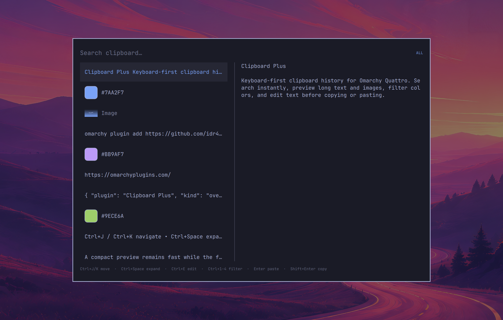

# Clipboard Plus & shelf

A keyboard-first overlay for Omarchy Quattro's clipboard history, with type
filters, large text and image previews, color swatches, inline text editing,
and a persistent multi-shelf organizer.



Clipboard Plus is a UI companion to Omarchy's built-in `omarchy.clipboard`
plugin. It reads the same resident history and uses Omarchy's clipboard
helpers, so it does not start another `wl-paste` watcher or Quickshell process.

## Features

- Search clipboard history by typing
- Navigate with the arrow keys or `Ctrl+J` / `Ctrl+K`
- Filter all entries, text, images, or six-digit hexadecimal colors
- Preview long text, images, and detected colors without leaving the overlay
- Edit text before copying or pasting it
- Paste, copy, open, remove, or clear history entries from the keyboard
- **Persistent shelves:** organize clipboard items into named shelves that
  survive reboots (`~/.local/state/omarchy/clipboard-shelf.json`)
  - add the selected history item to the active shelf with `Ctrl+S`
  - toggle between clipboard and shelf mode with `Ctrl+Shift+S`
  - create a new shelf with `Ctrl+N` (auto-named, up to 9 shelves)
  - switch the active shelf with `Ctrl+Tab` / `Ctrl+Shift+Tab`
  - paste a single shelf item with `Enter`, copy with `Shift+Enter`, or paste
    the entire shelf with `Alt+Enter`
  - rename the active shelf with `Ctrl+E`, remove an item with `Delete`, and
    delete a whole shelf with `Shift+Delete`
- Follow the active Omarchy theme through the shell's shared UI components

## Requirements

- Omarchy Quattro
- The built-in `omarchy.clipboard` plugin enabled, which is the Omarchy default
- Omarchy's standard clipboard history and helper commands

No additional packages, services, or background processes are required.

## Install

```sh
omarchy plugin add https://github.com/engineer-hamas/omarchy-clipboard-plus-and-shelf.git --enable
```

Clipboard Plus is an overlay and does not install a keybinding. To place it on
`SUPER+CTRL+V` while retaining the stock clipboard on
`SUPER+CTRL+SHIFT+V`, add this to `~/.config/hypr/bindings.lua`:

```lua
hl.unbind("SUPER + CTRL + V")
o.bind(
  "SUPER + CTRL + V",
  "Clipboard Plus",
  "omarchy-shell shell toggle engineer-hamas.clipboard-shelf"
)
o.bind(
  "SUPER + CTRL + SHIFT + V",
  "Clipboard",
  "omarchy-shell shell toggle omarchy.clipboard"
)
```

Apply and validate the binding:

```sh
hyprctl reload
hyprctl configerrors
```

The overlay intentionally uses Omarchy's `omarchy-clipboard` layer-shell
namespace so the stock no-animation rule also applies to Clipboard Plus. The
plugin IDs remain separate; this only shares the compositor rule.

## Keyboard controls

| Key | Action |
| --- | --- |
| Type | Filter entries |
| `Up` / `Down`, `Ctrl+K` / `Ctrl+J` | Move selection |
| `Page Up` / `Page Down`, `Home` / `End` | Move through history |
| `Enter` | Paste the selected entry |
| `Shift+Enter` | Copy without pasting |
| `Alt+Enter` | Open with Omarchy's clipboard opener |
| `Ctrl+Space` | Open or close the expanded preview |
| `Ctrl+E` | Edit the selected text entry |
| `Ctrl+1` / `2` / `3` / `4` | Show all / text / images / colors |
| `Ctrl+T` / `Ctrl+Shift+T` | Cycle filters forward / backward |
| `Ctrl+R` | Reload history from disk |
| `Delete` | Remove the selected history entry |
| `Shift+Delete` | Confirm clearing all history |
| `Escape` | Clear the search, close a detail view, exit shelf mode, or close the overlay |
| `Ctrl+S` | Add the selected history entry to the active shelf |
| `Ctrl+Shift+S` | Toggle between clipboard history and the shelf |
| `Ctrl+N` | Create a new shelf (auto-named, switches to it) |
| `Ctrl+Tab` / `Ctrl+Shift+Tab` | Switch the active shelf (in shelf mode) |
| `Alt+Enter` | Paste the entire active shelf (in shelf mode) |

In shelf mode the same navigation, filtering, and preview shortcuts operate on
the active shelf's items. `Delete` removes the selected shelf item,
`Shift+Delete` deletes the whole shelf, and `Ctrl+E` renames it.

In the text editor:

- `Ctrl+Enter` pastes the edited text (or saves a shelf rename).
- `Ctrl+Shift+Enter` copies the edited text.
- `Escape` cancels editing.

## Privacy and permissions

Clipboard Plus runs unsandboxed inside the existing Omarchy shell, as all
Omarchy shell plugins do. It can therefore read clipboard contents, which may
contain sensitive information.

The plugin:

- reads and updates `~/.local/state/omarchy/clipboard-history.json`;
- refuses raw history files over 4 MiB before JSON parsing and retains the
  first 300 disk positions;
- represents individual text entries over 1,048,576 code units as
  metadata-only rows that preserve their disk indices for paste, copy, and
  open while keeping their contents out of search, preview, and editing;
- keeps plugin writes disabled while any oversized placeholder would remain;
  the last one can be deleted directly, while multiple require clearing
  history or removing them with the stock clipboard manager;
- caps aggregate retained text at 4,194,304 code units and rejects
  modifications that would exceed the cap instead of silently dropping entries;
- validates persisted image-entry paths and MIME types before loading previews;
- invokes Omarchy's packaged `omarchy-clipboard-paste-text`,
  `omarchy-clipboard-paste-file`, and `omarchy-clipboard-open` helpers;
- stores edited text as a new stock-format history entry and invokes it by
  history index, so edited clipboard contents are not exposed through process
  arguments;
- makes no network requests;
- requests no elevated privileges; and
- starts no persistent watcher, service, installer, or second Quickshell
  instance.

Removing or clearing entries modifies the history shared with the stock
clipboard manager.

## Remove

First remove the Clipboard Plus binding block from
`~/.config/hypr/bindings.lua` and reload Hyprland. Omarchy's stock
`SUPER+CTRL+V` binding will then be restored from its default configuration.

Remove the plugin:

```sh
omarchy plugin remove engineer-hamas.clipboard-shelf
```

## Development

Run the manifest validator, QML linter, and model tests from the repository
root:

```sh
omarchy plugin validate .
qmllint -I "$OMARCHY_PATH/shell" Clipboard.qml
node tests/clipboard-history.js
node tests/clipboard-shelf.js
```

Before releasing, also exercise open, close, paste, copy, edit, disable,
re-enable, shell restart, and removal against a current Omarchy Quattro
installation.

## Acknowledgements

Clipboard Plus is derived from Omarchy's stock clipboard history model and
overlay, then extended with filtering, expanded previews, and text editing.
The stock Omarchy clipboard
[implementation](https://github.com/basecamp/omarchy/tree/quattro/shell/plugins/clipboard)
is MIT-licensed; `LICENSE` retains its upstream copyright notice.

## License

[MIT](LICENSE)
